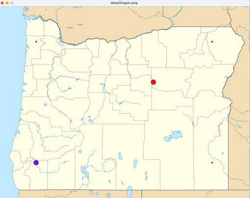

# HOWTO geographically cluster historical wildfire data


The small red dots in the screenshots above are locations of a past 
wildfire, recorded in a public database available from
[The National Interagency Fire Center.](
https://data-nifc.opendata.arcgis.com/datasets/nifc::wfigs-wildland-fire-locations-full-history)
The larger dots with rays out to the fire records represent the 
centroids of _clusters_ recorded fires.  The rays show which cluster 
each historical fire record is associated with. 

Clustering data is often an important step in working with large 
data sets.  It is considered an _unsupervised machine learning_ 
technique.  Sometimes clustering is useful in itself (e.g., we might 
cluster historical fire data to help determine where a new fire 
station is most needed), but more often it is a preliminary step for 
further analysis of a data set. 

The approach we will use to cluster locations of past wildfires is 
known as _naive k-means clustering_.  It is an example of a 
fundamental algorithmic approach in computing called _successive 
approximation_.  Successive approximation means gradually improving 
a guess until we have an acceptably good solution.  We can start 
with a very bad guess, as long as there is a way to improve it on 
each iteration of a loop.  In k-means clustering, we will start with 
a completely random assignment of wildfires to clusters.  Each time 
through the main loop, we will calculate the centroid of each 
cluster, then reassign wildfires to the cluster with the closest 
centroid.  For most practical datasets, naive k-means quickly 
_converges_ on good clusters. 

## Learning objectives

One of the objectives of this project, of course, is to introduce 
you to successive approximation as a problem-solving approach.  
K-means clustering is one example of this approach.  We will 
see at least one more example of successive approximation applied to 
geometric data this term, the Douglas-Peucker algorithm that 
cartography and geographic information systems use to draw "good 
enough" approximations of complex shapes.

In addition, this project will give you a lot of practice in 
building and looping through lists.  Our approach will use a 
structure called _parallel arrays_, meaning that we will associate 
items in distinct lists with the same index.  We will use parallel 
arrays to associate each cluster with a list of wildfire locations 
and with whatever display is associated with that cluster. 

Note:  Data science majors and other users of Python Pandas may be 
interested to know that the `Series` (columns) in a Pandas `DataFrame` 
are parallel arrays.  Similar "column-wise" organizations of 
parallel arrays are also 
widely used in scientific computing because, for the most common access 
patterns to very large data sets, they can be more efficient than
"row-wise" organization of the same tabular data. 

## Georeferenced data: Lat-Lon and UTM

Many available data sets included location information encoded as 
(latitude, longitude) pairs, which represent positions on the 
surface of a spheroid.  As our display media is generally flat 
rather than spherical, map displays require some _projection_ from 
spherical coordinates to a planar coordinate system.  There is no 
single _best_ projection.  Every projection from a spheroid onto a 
plane must necessarily distort something, whether that be direction 
or area or something else.  

For clustering records that are close together, we want to use a 
coordinate system that is good for calculating distance.  It is 
possible to calculate distance from (latitude, longitude) pairs, but 
it is quite complex.  The length of one degree of latitude or 
longitude varies with location, and the length of one degree of 
latitude is usually not the same as the length of one degree of 
longitude.  Translating one degree of longitude as the same distance 
everywhere is the reason Mercator projections make Greenland look as 
large as South America.  That doesn't mean Mercator is bad for 
all purposes, only that it is inappropriate for some purposes.

We will base our analysis on the data in `data/WFIGS_History.csv`, 
exported directly from a database provided by the National 
Interagency Fire Center.  This data is provided in the _comma 
separated values_ format, compatible with spreadsheets like Excel 
and Google Sheets as well as many database applications.  We can 
think of it as a grid in which each row is the record of a single 
wildfire, and each column is some attribute of wildfires.  Among the 
columns is one labeled `X`, for degrees longitude, and one labeled 
`Y`, for latitude.  This is the location data we need.  However, as 
we wish to cluster data by geographic distance, latitude and 
longitude (often called "lat-lon") are not easy to use.  

I have pre-processed this database into another file, 
`data/fire_locations_utm.csv`.  This is the same data, with two 
extra columns, `Easting`, `Northing`, and `UTM Zone`.  These columns 
represent location data using a map projection called
[Universal Transverse Mercator](
https://en.wikipedia.org/wiki/Universal_Transverse_Mercator_coordinate_system),
abbreviated UTM.  The unit of UTM coordinates is meters, relative to 
the origin of a _zone_.  Dividing earth's surface into zones avoids 
the extreme distortion of a Mercator projection, while using meters 
as units makes distance calculation easy, provided we are measuring 
distance between points in the same zone.

Most of Oregon is in UTM zone T10.  Some of eastern Oregon is in UTM 
zone T11.  I have translated all of the wildfire coordinates 
relative to zone T10, even if they properly belong to zone T11.  
This means that there will be some moderate distortion for the 
locations of points in eastern Oregon.  We will accept that much 
distortion for the sake of simple distance calculations.  _The 
distortion would be much worse, and would not be acceptable, for a 
significantly larger area like the 
whole of Europe or the continental United States_. 

### Smaller data files

Programmers spend a lot of time debugging.  Large data files can 
make debugging slow and difficult, and even make it difficult to 
judge whether a program is executing as expected.  To mitigate this, 
I have created additional data files in the same format as
`fire_locations_utm.csv`. 

- `data/test_locations_utm.csv` is a minimal file with just four 
  fire records, near the northwest, northeast, southwest, and 
  southeast corner of Oregon.  This is "synthetic" (fake) data. 
- `data/fire_excerpt_utm.csv` is real data taken from the
  `fire_locations_utm.csv` file, but much less of it.  It contains
  the first 50 fire records from the database. 
- `data/fire_five_utm.csv` is an even shorter excerpt of real
  data with just five fires.  This very small data set can be useful 
  for debugging. 


## Displays: Visual, Audio, and Text

When we think of a "display", we may be inclined to think only of a 
graphical display.  There are several reasons to consider a more 
general notion of what a "display" could be, and to include modalities 
other vision.  A key reason is accessibility: A non-visual display may 
be more accessible to users with limited or no vision.  Additionally,
an application that has been designed for multiple display 
modalities will typically be easier to adapt to other display 
variations, such as mobile and desktop versions. It can also be 
useful to create diagnostic displays that are targeted
to developers for 
debugging, in addition to displays that are intended for end-users.

The original version of the wildfires project had only a graphical 
display, on a map.  This version has two additional, rather 
rudimentary displays.  An audio display can play notes in which 
easting and northing coordinates are represented by tones in a 
musical scale (one ping for easting, another for northing).  The 
text "display" is just printed text.

The source file you will work on will make calls to a display 
module that can produce any or all three of the supported modalities.
Your program will be _agnostic_ regarding modality; it will simply 
ask first and clusters to be plotted, and let the display module 
forward requests to the modality-specific displays.  The display 
module will consult a _configuration file_ `config.py` to determine 
which displays to employ. 

```python
# Excerpt of config.py
DISPLAY_VISUAL = True     # Make a visual display of the data
DISPLAY_AUDIO = True      # Make an audio display of the data (requires Pygame)
DISPLAY_TEXT = True       # Print the data (with verbosity level below)
TEXT_VERBOSITY = 5  # Verbose
```

Note:  Next term in CS 211 we will learn a more powerful and 
flexible way to associate one or more displays with our data 
structures. 

## Visual display

A graphical display is included if `config.py` sets variable
`DISPLAY_VISUAL` to `True`: 

```python
DISPLAY_VISUAL = True     # Make a visual display of the data
```

Several other entries in `config.py` provide information necessary 
for the visual display, such as the relation between UTM coordinates 
and screen pixels.  You should not have to modify any except the 
`DISPLAY_VISUAL` variable itself.  

## Text display

The text "display" is controlled by variable `DISPLAY_TEXT` in 
`config.py`.  You could disable it by setting `DISPLAY_TEXT` to 
`False`, but you'll probably want to leave it enabled.  You can 
further control how much is printed by setting a verbosity level, 
controlled by variable `TEXT_VERBOSITY`. A verbose level is best for 
initial debugging: 

```python
# verbosity levels
DISPLAY_CLUSTERS_ONLY = 1
DISPLAY_FIRES_CONCISE = 3
DISPLAY_FIRES_VERBOSE = 5
TEXT_VERBOSITY = DISPLAY_FIRES_VERBOSE  
```

At the verbose level, the position of a fire or cluster will be 
displayed with UTM coordinates, and also scaled to 10 "grid" points, 
like this: 

```pycon
Fire at 3, 0 (554203, 4655291)
Fire at 8, 5 (909370, 4931132)
Fire at 1, 0 (475718, 4660129)
Fire at 3, 2 (568287, 4746368)
Fire at 2, 2 (535456, 4757377)
```

This setting may be best for initial debugging with very small data 
sets.  When testing with larger data sets, you may prefer only the 
scaled grid coordinates.  Set `TEXT_VERBOSITY` to 
`DISPLAY_FIRES_CONCISE` to make the textual display look like this: 

```pycon
Fire at 3, 0
Fire at 8, 5
Fire at 1, 0
Fire at 3, 2
Fire at 2, 2
```

For larger data sets, you may not wish to display individual fire 
coordinates at all.  Set `TEXT_VERBOSITY` to `DISPLAY_CLUSTERS_ONLY` 
to suppress them. 


## Audio display

The audio display at this time is rudimentary, and you may want to 
disable it. It is controlled by variable `DISPLAY_AUDIO` in 
`config.py`.  The audio is pairs of tones from the C scale, 
interpolated from UTM coordinates similar to the grid coordinates in 
the text display. 

Audio display also requires installing the `PyGame` Python module, 
which is not part of a standard Python distribution.  If you set 
`DISPLAY_AUDIO` to `True` and you have not installed `PyGame`, you 
will get an error message asking you to install it. 

## Getting started: A basic plot

Our graphical display will plot wildfire records and clusters over a 
background map of 
Oregon.  This _basemap_ was produced using an equal-area projection, 
which is close but not identical to a projection based on UTM 
coordinates. It is close enough that we can get a reasonable idea of 
where recorded wildfires occur from the plot.  (There is no basemap 
for the text or audio displays.)

I like to start a project that involves graphics or plots with a 
basic data display, before beginning any analysis.  That provides 
some reassurance that the data I am working with is reasonable, and 
it helps me quickly visualize other information to debug my mistakes.
For example, when I was preparing this project, I plotted four 
points at the north, south, east, and west corners of the mapped 
area.  At first they all appeared in eastern Oregon, because my 
translation of UTM coordinates to pixel coordinates was wrong.

While the text and audio displays lack a basemap, we similarly want 
to start with a very basic and predictable output for them. 

### Skeleton

Start with the usual skeleton for an application that includes 
doctests. 

```python
"""Geographic clustering of historical wildfire data
CS 210, University of Oregon
Your Name Here
Credits: TBD
"""
import doctest


def main():
    doctest.testmod()

if __name__ == "__main__":
    main()
```

We will be taking data from a comma-separated values file, so add 
`import csv` just after the import of `doctest`.   We will also need 
to import the provided `display` module.  [Python style guidelines](
https://peps.python.org/pep-0008/#imports) recommend placing "local"
imports after imports of system library modules, like this:

```python
import doctest
import csv

import display
```

I always feel better when I get _something_ to display.  Let's 
create the basemap image and display it.  The image is in portable 
network graphics (PNG) form, in file `data/Oregon.png`.  Our 
`config` module includes that information, along with information 
about coordinates of the corners of the area represented by the 
basemap. 

Now we will need only a single line in our `main` function to 
create and display the map.  However, if we just create it and then 
end the program, the map will display momentarily and disappear.  
We'll add one more line to keep the display visible until the user 
presses enter. 

```python
def main():
    doctest.testmod()
    fire_map = display.Display()
    input("Press enter to quit")
```

With visual display enabled, you should see something like this: 


With audio display enabled, you should hear a bicycle bell (an 
arbitrary choice because it is short, not too unpleasant, and a
free .wav file I could find easily).  You will also see a message 
from the `pygame` module in the console: 
```pycon
pygame 2.5.0 (SDL 2.28.0, Python 3.10.0)
Hello from the pygame community. https://www.pygame.org/contribute.html
```

### Read the data

We will use a  `csv.DictReader` to read the wildfire data.  You may 
wish to 
refer to code you have written with a `DictReader` to read course 
enrollment data, and you may wish to refer to the
[Python library documentation](
https://docs.python.org/3/library/csv.html) for the `csv` module.

Although the dataset contains a lot of information, for now we just 
want the UTM coordinates of each recorded wildfire. These 
coordinates are in the `Easting` and `Northing` columns (which you 
can think of as the `x` and `y` coordinates of a graph with the 
origin at the southwest corner of the area).  

```python
def get_fires_utm(path: str) -> list[tuple[int, int]]:
    """Read CSV file specified by path, returning a list 
    of (easting, northing) coordinate pairs within the 
    study area. 
    
    >>> get_fires_utm("data/test_locations_utm.csv")
    [(442151, 4729315), (442151, 5071453), (914041, 4729315), (914041, 5071453)]
    """
```

You will need to specify the encoding and line-ending conventions 
for the input file, like this: 

```python
    with open(path, newline="", encoding="utf-8") as source_file:
        reader = csv.DictReader(source_file)
```

UTF-8 is the most common of several possible encodings of the 
Unicode character set, which supports characters from many languages 
around the world.  I am not certain why the specification of the 
line-ending convention is required, but the csv module 
documentations says we need it when using a `DictReader`, so here it 
is.  I know these are necessary because encountered errors until I 
added `newline=""` and `encoding="utf-8"`.  (As of fall 2023, this
seems to differ between Windows and MacOS even with the same version 
of Python, but the encoding option always works even if it is not 
always required.)

Note that the data we read from the input file is all text.  The 
string value `"554203"` is not a number, even though all of its 
characters are digits!  It is a string that 
can be converted to an integer (type `int`), like this: 

```python
   easting = int(row["Easting"])
```

Although the records in `data/fire_locations_utm.csv` are mostly 
within the area of the map, a few are outside.  It's a good idea to 
exclude these.  We can write a function to determine whether a point 
is within or outside the map area, using information from `config.py`:

```python
def in_bounds(easting: float, northing: float) -> bool:
    """Is the UTM value within bounds of the map?"""
    if (easting < config.BASEMAP_ORIGIN_EASTING
        or easting > config.BASEMAP_EXTENT_EASTING
        or northing < config.BASEMAP_ORIGIN_NORTHING
        or northing > config.BASEMAP_EXTENT_NORTHING):
        return False
    return True
```

Write `get_fires_utm` to return a list of coordinate pairs that are 
within bounds of the mapped area.   The test file 
`data/test_locations_utm.csv` provides data for the included 
test case, including two points that should be excluded because they 
are outside the study area. 

### Plot the data

Plotting the fire data is now straightforward.  We will use the 
`display` module to create a `Display` object that contains the 
state of the visual, textual, and/or audio displays.  I called it 
`fire_map` since the visual version looks like a map: 

```python
fire_map = display.Display(display_visual=True)
```

Next we use our `get_fires_utm` function to return a list of fire 
coordinates: 

```python
fires = get_fires_utm(config.FIRE_DATA_PATH)
```

We can add two lines to our main program:

```python
    for fire_easting, fire_northing in fires:
        fire_map.plot_fire(fire_easting, fire_northing)    
```

Note that these lines go _before_ the line that asks the user to 
press enter to quit.  

The test data in  `data/test_locations_utm.csv`
is four points approximately 100km from the east, west,
north, and south boundaries, which should give a display that looks 
like this: 


Your text display should look like this if `TEXT_VERBOSITY` is set 
to `DISPLAY_FIRES_VERBOSE`: 

```pycon
Fire at 1, 1 (442151, 4729315)
Fire at 1, 8 (442151, 5071453)
Fire at 8, 1 (914041, 4729315)
Fire at 8, 8 (914041, 5071453)
```

Your audio display, if enabled, should likewise play four pairs of 
tones.  The first note in each pair indicates easting,
and the second indicates northing.  

## Parallel lists

Now that we can read and plot a dataset, it is 
time to 
take on the core of our project, which is to find _clusters_ of fire 
records.   We will do that by successive approximation:  We will 
first make a _very bad_ guess as to how to group data, and then we 
will enter a loop, refining our guesses.  

We will represent groupings using parallel arrays:  

- One list will hold centroids of our current set of clusters.
- Another list will hold lists of points assigned to clusters
- The indexes of the list of centroids will be the same as the 
  indexes of the lists of assigned points. 

In addition we will keep a list of the display 
data associated with each cluster, again with the same 
indexes.  This will permit us to move elements of the
visual display around as our estimates improve. 


The diagram illustrates that we will have three distinct lists with 
corresponding indexes.  One of these lists will hold centroids 
(center points) of clusters.  Another will hold references to their 
display in the `Display` structure. A third will hold a list of fire 
coordinates.   What we think of as a "cluster" will be a row 
consisting of an element from each of these three distinct lists. 
For example, the 
display symbol at index 2, 
the centroid coordinates at index 2, and the list of wildfire 
locations at index 2 (taken from our list `points`) are the 
components of a single cluster. 

## An initial guess 

How can we make an initial bad guess?  Let's make it random.  I will 
provide an implementation of random assignment, which you may find 
useful as a starting point for the improved assignment step that I 
will ask you to do create shortly. 

You will need to add `import random` to the sequence of import 
statements near the beginning of your application.  Then you can
include this function for returning a random assignment to _n_ 
clusters.

```python
def assign_random(points: list[tuple[int, int]], n: int) -> list[list[tuple[int, int]]]:
    """Returns a list of n lists of coordinate pairs.
    The i'th list is the points assigned randomly to the i'th cluster.
    """
    # Initially the assignments is a list of n empty lists
    assignments = []
    for i in range(n):
        assignments.append([])
    # Then we randomly assign points to lists
    for point in points:
        choice = random.randrange(n)
        assignments[choice].append(point)
    return assignments
```

The header of `assign_random` might look intimidating.  It's not too 
bad if we break it down.  First, consider

```python
points: list[tuple[int, int]]
```
This says points is a list, and each element of the list is a pair 
of integers.  In other words, this looks like our list of wildfire 
coordinate pairs. 

Next we have `n`, an integer that says how many lists of points we 
should make.   We use it first to create enough empty lists: 

```python
    assignments = []
    for i in range(n):
        assignments.append([])
```

and later we use `n` to randomly choose a one of the lists to add a 
point to. 

The result type for this function is 

```python
list[list[tuple[int, int]]]
```

Let's just work from the inside out. The innermost part is
`tuple[int, int]`, which is our representation of a coordinate pair. 
These are kept in a list, which will be the list of points assigned 
to one cluster, i.e., the _assignment of points_ to this cluster.  
We will have `n` clusters, so we need a list of `n` assignments. 

In our main function, we can create this initial random assignment of 
points to clusters: 

```python
    partition = assign_random(fires, config.N_CLUSTERS)
```

Considering this is a _random_ assignment of points to clusters, I 
cannot think of a way to write a test case for it.  Shortly, though, 
we can create a graphical display to at least give us an idea of 
whether it looks like a random assignment. 

## Centroids

We will use a very simple definition of the centroid of a set of 
points: The x coordinate of the centroid will be the average 
(arithmetic mean) of the x coordinates of points in the set, and the 
y coordinate will be the arithmetic mean of the y coordinates of the 
individual points.   Since we are using integer coordinates for points, 
we'll also use integer coordinates for the centroid. This 
might be 
a problem if we were plotting points in a very small area, but for a 
map at the scale of an entire state, accuracy within a meter or two 
is fine.  Don't bother with rounding; just use the `//` integer 
division operation, which will be off by at most half a meter.

```python
def centroid(points: list[tuple[int, int]]) -> tuple[int, int]:
    """The centroid of a set of points is the mean of x and mean of y"""
```

You will need to loop through `points`, keeping a sum for the `x` 
coordinates and a sum for the `y` coordinates. You can then divide 
each by `len(points)` to get the mean.  Use the `//` integer
division operation to round down to an integer.  

You may note that this is 
another instance of the _accumulator pattern_ that we saw in the 
course enrollment analysis. 

There is one catch:  What is the centroid of an empty list of points?
At first this is unlikely to occur, but later as we shuffle points 
among clusters, it is common for some of them to become empty.  
We'll have to treat this as a special case.  The approach I used was 
to return the value (0, 0) as the imaginary centroid of an empty 
list of points.  The location (0, 0) is outside the bounds of our 
basemap, so placing empty clusters at (0, 0) has the effect of 
hiding them in the graphic display.  (Our audio display will
treat (0,0) as a special case to skip.)

To keep our main function short, we can write a very simple function 
for computing the centroids of all the clusters: 

```python
def cluster_centroids(clusters: list[list[tuple[int,int]]]) -> list[tuple[int,int]]:
    """Return a list containing the centroid corresponding to each assignment of
    points to a cluster.
    """
    centroids = []
    for cluster in clusters:
        centroids.append(centroid(cluster))
    return centroids
```

I'm too impatient to write a test case for this simple function, but 
I'll come back to it if the next step doesn't work.  We'll call 
cluster_centroids 
in the main function like this: 

```python
    centroids = cluster_centroids(partition)
```

## Plot the centroids

We'll need a function for plotting a set of (easting, northing) 
pairs on the map.  It will return a list of references to the
display data.  In other words, given the list of centroids, it will 
return a parallel list of (references to) their display data.

```python
def plot_centroids(map: display.Display, 
                   centroids: list[tuple[int, int]]
                   ) -> list[int]: 
    """Creates a display of each cluster, and returns a list of
    references to the display data created (as integers)
    """
    display.mark_cycle() 
    symbols = []
    for easting, northing in centroids:
        symbol = map.plot_cluster(easting, northing)
        symbols.append(symbol)
    return symbols
```

`plot_centroids` begins with a call to `mark_cycle` so that
successive rounds of clustering can be distinguished. 

We'll call this function from `main` after our initial (random) 
assignment.  

```python
    symbols = plot_centroids(centroids)
```

Since we began with a random assignment of first to clusters,
displays of clusters will vary from one run to the next.  However,
with our tiny set of four points in corners, it is not too hard to 
determine whether the initial clusters look reasonable.  A typical 
run might provide a textual display like this: 

```pycon
Fire at 1, 1 (442151, 4729315)
Fire at 1, 8 (442151, 5071453)
Fire at 8, 1 (914041, 4729315)
Fire at 8, 8 (914041, 5071453)
Cluster at 6, 3
Empty cluster
Cluster at 1, 8
```

The random assignment left one of the clusters empty.  Another had 
only the fire at grid point (1, 8), so its centroid was exactly that 
point.  Apparently the other three points were assigned to the 
remaining cluster, so it was assigned a position roughly central to 
those three points. 

If you are using the visual display, it should be consistent with 
the textual display.  For the textual display above, the 
corresponding graphic would be




At this point you may wish to experiment with  larger data 
set, by changing the value of `FIRE_DATA_PATH` in `config.py`.  Be 
warned, the audio display is very slow with large data sets.  I 
found it barely tolerable with `data/fire_excerpt_utm.csv`, which 
gave me this visual plot: 

[Three initial clusters with 50 fires](img/cluster_excerpt.png)

The centroids are near the center of the plot.  In the textual 
display, we can see that one of them is actual covering another: 

```pycon
Fire at 3, 0 (554203, 4655291)
Fire at 3, 2 (547961, 4773357)
... many lines like this
Fire at 5, 1 (684495, 4705369)
Cluster at 5, 3
Cluster at 5, 4
Cluster at 5, 4
```

Can you 
explain why?  Discuss with your classmates why we should usually 
expect the initial centroids to be near the center.  If you 
understand it, try explaining to a classmate.  If you don't 
understand it, give a classmate an opportunity to explain it to you. 
Finding a clear way to explain something is a good way to deepen 
your own understanding, and often leads to new insights. 

## Improving the clusters

Now we have a way of making a very bad guess at the clusters.  The 
successive approximation method works by improving a guess, over and 
over until we are satisfied or stop making progress. 

Our bad guess came from randomly assigning points to clusters.  We 
can improve it by assigning points to the _nearest_ cluster.  To 
determine which cluster is nearest, we will calculate the distance 
from each point to each cluster centroid ... almost.  

Euclidean 
distance between $(x_1, y_1)$ and $(x_2, y_2)$ is 
$$\sqrt{(x_2 - x_1)^2 + (y_2 - y_1)^2}$$.
However, we don't really 
need to know the distance between points.  We just need any 
_monotone function_ of distance.  A function _f_ is _monotone_ if

$$ x \gt y \rightarrow f(x) \gt f(y) $$

The square of distance, 
which we get if we just skip taking the square root of
$$(x_2 - x_1)^2 + (y_2 - y_1)^2$$
is a monotone function of 
distance:  The greater the distance, the greater the square of 
distance.  So instead of finding the cluster with the smallest 
distance from a point, we can find the cluster with the smallest 
squared distance from a point.  This has the added advantage of 
working well with integers.  

I'll provide the function for finding the square of distance between 
two points: 

```python
def sq_dist(p1: tuple[int, int], p2: tuple[int, int]) -> int:
    """Square of Euclidean distance between p1 and p2

    >>> sq_dist((2, 3), (3, 5))
    5
    """
    x1, y1 = p1
    x2, y2 = p2
    dx = x2 - x1
    dy = y2 - y1
    return dx*dx + dy*dy
```

With that, you can create a function to determine which of a set of 
points is closest to another point.  Note that the result of this 
function should not be the point, but rather the index in the list 
where that point appears: 

```python
def closest_index(point: tuple[int, int], centroids: list[tuple[int, int]]) -> int:
    """Returns the index of the centroid closest to point

    >>> closest_index((5, 5), [(3, 2), (4, 5), (7, 1)])
    1
    """
```


While we find that (5, 5) is closest to point (4, 5)
in the list `centroids`, we return the _index_ of that
point, which is 1, rather than the point itself.  In this
way our result refers to the whole imaginary row of values
at index 1 in our parallel lists. 

### Partition the points

We have already seen a function that makes random assignments of 
points to clusters.  Now you need a function that instead makes a 
_good_ assignment, assigning each point to the cluster with the 
closest centroid.   Here is the header for that function: 

```python
def assign_closest(points: list[tuple[int,int]],
                   centroids: list[tuple[int, int]]
                   ) -> list[list[int, int]]:
    """Returns a list of lists.  The i'th list contains the points
    assigned to the i'th centroid.  Each point is assigned to the
    centroid it is closest to.

    >>> assign_closest([(1, 1), (2, 2), (5, 5)], [(4, 4), (2, 2)])
    [[(5, 5)], [(1, 1), (2, 2)]]
    """
```

Let's consider what this function does with the test case. 


`assign_closest` inspects the first point, (1,1), and
uses `closest_index` to determine that (1,1) is closest to (2,2), 
which is at index 1.  It adds (1,1) to the list of assignments at 
index 1.  It similarly inspects point (2,2) and again finds that it 
fits best in the cluster at index 1.  It inspects point (5,5) and 
finds that (5,5) is closer to (4,4) and therefore goes in the 
assignment at index 0.  It returns the list of assignments, which is 
now [[(5,5)], [(1,1), (2,2)]], i.e., (5,5) is assigned to the first 
cluster and (1,1) and (2,2) both assigned to the second. 

To write this function, start with a copy of `assign_random`, then 
change the random choice to selection by closest centroid.  Instead 
of `n` clusters, you can find the number of clusters as
`len(centroids)`. 

To see our progress, we'll add a function that moves each of symbols 
representing clusters to their new centroids:

```python
def show_moves(fire_map: display.Display,
               symbols: list[int],
               locations: list[tuple[int, int]]):
  """Display movement of symbols to new positions.
  Symbols and locations (centroids) are parallel lists.
  Each element symbols[i] will e moved to the 
  corresponding locations[i]. 
  """
  for i in range(len(symbols)):
    fire_map.move_symbol(symbols[i], locations[i])
```


I'd also like to see how the fires are grouped at the end, so I'll 
write one more function to display connections at the conclusion:

```python
def show_clusters(fire_map: graphics.utm_plot.VisualMap,
                  centroid_symbols: list,
                  assignments: list[list[tuple[int, int]]]):
  """Connect each centroid to all the points in its cluster"""
  for i in range(len(centroid_symbols)):
    fire_map.connect_all(centroid_symbols[i], assignments[i])
```

We can test how it does after one reassignment of points to clusters: 

```python
def main():
    doctest.testmod()
    fire_map = display.Display()
    fires = get_fires_utm(config.FIRE_DATA_PATH)
    for fire_easting, fire_northing in fires:
        fire_map.plot_fire(fire_easting, fire_northing)

    # Initial random assignment
    partition = assign_random(fires, config.N_CLUSTERS)
    centroids = cluster_centroids(partition)
    symbols = plot_centroids(fire_map, centroids)

    # Improved assignment
    partition = assign_closest(fires, centroids)
    centroids = cluster_centroids(partition)
    show_moves(fire_map, symbols, centroids)

    # Show connections at end
    fire_map.show_connections(symbols, partition)

    input("Press enter to quit")
```

You are likely to observe that the cluster centroids are already 
starting to spread out toward true clusters. 


With a small number of fires, three clusters
(`N_CLUSTERS = 3`), and the text verbosity 
set to
`DISPLAY_CLUSTERS_ONLY`, the textual display might look
like this: 

```pycon
Clustering
Cluster at 4, 4
Cluster at 6, 4
Cluster at 5, 3

Clustering
Cluster at 4, 4 moved to 3, 3
Cluster at 6, 4 moved to 8, 6
Cluster at 5, 3 moved to 4, 1
Cluster at 3, 0 (554203, 4655291) contains 14 fire records
Cluster at 3, 2 (547961, 4773357) contains 10 fire records
Cluster at 7, 6 (830769, 4990031) contains 5 fire records
Press enter to quit
```

## Iterate to a solution

Now we have a way to make a bad guess, and a way to make a guess 
better (by reassigning points to clusters).  If we put those two 
steps in a loop, plotting their current positions after each round 
of assigning points and recalculating centroids, we will see them 
move toward the centers of natural clusters of points.  Some will 
become empty and move off the screen; I typically get seven or eight 
clusters. 

How can we know when to stop? We can set an arbitrary bound (e.g., 
twenty iterations), but usually we will converge on a stable 
solution long before a safe bound.  If the assignment of points to 
clusters does not change from one iteration of the loop to the next, 
it will remain fixed at that assignment.  The final version of our 
main function can therefore look like this: 

```python
def main():
    doctest.testmod()
    fire_map = display.Display()
    fires = get_fires_utm(config.FIRE_DATA_PATH)
    for fire_easting, fire_northing in fires:
        fire_map.plot_fire(fire_easting, fire_northing)

    # Initial random assignment
    partition = assign_random(fires, config.N_CLUSTERS)
    centroids = cluster_centroids(partition)
    symbols = plot_centroids(fire_map, centroids)

    # Improved assignment
    for i in range(config.MAX_ITERATIONS):
        old_partition = partition
        partition = assign_closest(fires, centroids)
        if partition == old_partition:
            # No change ... this is "convergence"
            break  # This "breaks out" of the "for" loop
        centroids = cluster_centroids(partition)
        show_moves(fire_map, symbols, centroids)

    # Show connections at end
    fire_map.show_connections(symbols, partition)
    input("Press enter to quit")
```

You may see a result something like this: 


With a small amount of data and the lowest setting of
`config.TEXT_VERBOSITY`, the textual display might look
something like this: 

```pycon
Clustering
Cluster at 2, 3
Cluster at 5, 4
Cluster at 5, 4

Clustering
Cluster at 2, 3 moved to 2, 2
Cluster at 5, 4 moved to 6, 6
Cluster at 5, 4 moved to 7, 4

Clustering
Cluster at 2, 2 moved to 3, 2
Cluster at 6, 6 unchanged
Cluster at 6, 6 nudged slightly
Cluster at 7, 4 moved to 8, 5

Clustering
Cluster at 3, 2 unchanged
Cluster at 3, 2 nudged slightly
Cluster at 6, 6 moved to 5, 5
Cluster at 8, 5 moved to 9, 6

Clustering
Cluster at 3, 2 unchanged
Cluster at 3, 2 nudged slightly
Cluster at 5, 5 nudged slightly
Cluster at 9, 6 moved to 8, 6
Cluster at 3, 0 (554203, 4655291) contains 15 fire records
Cluster at 3, 2 (547961, 4773357) contains 5 fire records
Cluster at 7, 6 (830769, 4990031) contains 9 fire records
Press enter to quit
```

It will not always be the same.  The naive k-means clustering 
algorithm will converge to different solutions depending on the 
initial random assignment.  It is common to run it multiple times 
and take the "best" solution, for some definition of "best".

## Challenge yourself

There are many variations on naive k-means.  For example, when one 
of the clusters becomes empty, you might consider "stealing" half 
the points from a cluster with more than its share, thereby 
subdividing the largest clusters.  There are many good sources 
online describing both small variations and completely different 
approaches to clustering. 

You might also experiment with selecting the data.  We have been 
treating all wildfires as equivalent, regardless of size.  We see a 
very large number of wildfire records around the Portland 
metropolitan area, but some of them are very small.  Could it be 
that a small fire near a major metropolitan area is more likely to 
be observed and recorded than a small fire in a more rural area?  
Would you get different clusters if you used only records of larger 
fires (e.g., using the `DailyAcres` column to select first of at 
least 10 acres)?  


